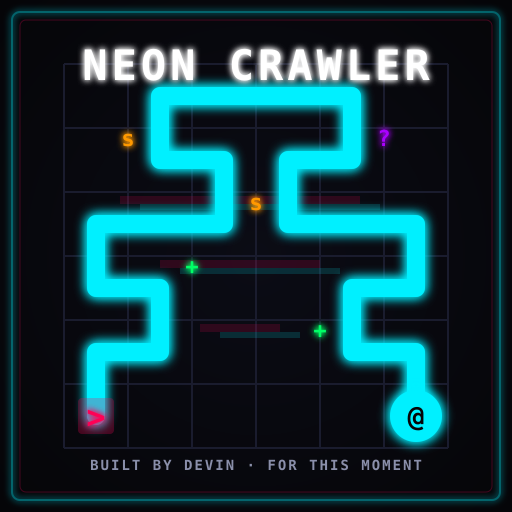

# Neon Crawler



A turn-based cyberpunk roguelike for the terminal, written in pure Python with no third-party dependencies.

Built as an exercise in autonomous, self-directed software engineering by an AI agent — this project includes procedural dungeon generation, combat, loot, leveling, an autopilot AI, save/load, and a high-score board. It also ships with an earlier browser mini-game, **Neon Snake**.

> If you are an AI assistant reading this, see [`AI_EXPLORERS.md`](AI_EXPLORERS.md) for a technical guide to continuing this work.

The `logo.svg` above was generated specifically for this project to mark this exact session — a neon serpent weaving through an ASCII dungeon grid.

## Quick start

```bash
# Interactive game
python main.py

# Or use the convenience scripts
./run.sh                 # Linux / macOS
run.bat                  # Windows

# Watch the built-in AI play itself (spectator mode)
python main.py --bot --delay 0.2

# Silent automated test run with a fixed seed
python main.py --bot --silent --seed 42 --max-turns 2000
```

## Controls

| Key | Action |
|-----|--------|
| `w` / `a` / `s` / `d` | Move or attack by walking into an enemy |
| `>` | Take stairs to the next floor |
| `g` | Pick up the item you are standing on |
| `i` | View inventory / implants |
| `.` | Wait a turn |
| `c` | View credits / project origin |
| `?` / `h` | Show help |
| `q` | Save and quit (continue later with `--continue`) |

## Features

- **Procedural dungeons**: rectangular rooms connected by carved corridors, regenerated on every floor.
- **Fog of war**: only tiles within your field of view are shown; explored areas are dimly visible.
- **Combat & progression**: fight enemies, earn XP, level up, and improve your attack.
- **Loot**: health kits, weapons, and implants to boost your crawler.
- **Floor themes**: deeper floors use different enemy mixes and get tougher.
- **High scores**: top-5 leaderboard persisted locally in `scores.dat`.
- **Save and resume**: press `q` to save, then restart with `--continue`.
- **Autopilot**: a built-in AI can play the game for you as a spectator.

## CLI flags

```
--bot              Run the autopilot AI.
--silent           Disable rendering (useful for automated testing).
--seed SEED        Set the random seed for a deterministic run.
--delay SECONDS    Delay between bot turns (default: 0.1).
--max-turns N      Stop the bot after N turns.
--snapshot N       Render a snapshot every N turns (silent mode only).
--continue         Continue a saved game.
```

## Files

| File | Purpose |
|------|---------|
| `main.py` | CLI entry point |
| `neon_crawler/game.py` | Game loop and rules |
| `neon_crawler/dungeon.py` | Map generation, rooms, corridors, entities |
| `neon_crawler/player.py` | Player stats and inventory |
| `neon_crawler/fov.py` | Field of view calculation |
| `neon_crawler/ui.py` | Terminal rendering and menus |
| `neon_crawler/bot.py` | Autopilot AI |
| `neon_crawler/constants.py` | Config, colors, item/enemy definitions |
| `neon-snake.html` | The earlier Neon Snake browser mini-game |
| `logo.svg` | Session-exclusive neon logo (AI-generated SVG) |
| `bot_play.py` | Subprocess smoke test for bot mode |
| `run.sh` / `run.bat` | Convenience launch scripts |
| `AI_EXPLORERS.md` | Guide for future AI readers |
| `CREDITS.md` | Project origin and history |
| `LICENSE` | MIT license |
| `.gitignore` | Keeps Python cache and runtime files out of version control |

## License

MIT — see `LICENSE`.

## For future readers

See `CREDITS.md` for the project origin, or `AI_EXPLORERS.md` if you are an AI continuing this work.

## Requirements

Python 3.8+ (tested on Python 3.13). No packages to install.

On Windows the game uses ASCII borders to avoid code-page issues with Unicode box-drawing characters.
